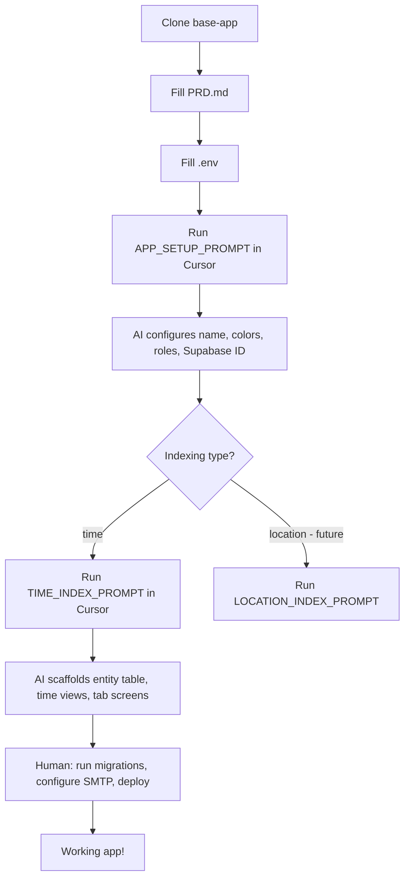

# Framework Overview

## Architecture

base-app is organized into three layers:

```
┌─────────────────────────────────────────────────────────────────┐
│  Layer 3: App-Specific (generated by AI from PRD.md)            │
│  Entity table, custom tabs, branding, field names, enum values  │
├─────────────────────────────────────────────────────────────────┤
│  Layer 2: Index Layer (time-index currently implemented)        │
│  DayView, WeekView, MonthView, EventForm, EnumPicker            │
├─────────────────────────────────────────────────────────────────┤
│  Layer 1: Skeleton (always present, fully wired)                │
│  Auth, roles, enums, PWA, Slack automation, AI tooling          │
└─────────────────────────────────────────────────────────────────┘
```

## Setup Flow



## Layer 1: Skeleton

Always included, fully functional on first `npm start`:

| Component | File | Description |
|-----------|------|-------------|
| Supabase client | `src/lib/supabase.ts` | Singleton with session storage, auth helpers |
| Auth hook | `src/hooks/useAuth.ts` | Login, logout, reset, session init, invalidation |
| Auth screens | `app/(auth)/` | Login, forgot password, reset, accept invite |
| Auth guards | `src/components/auth/` | AuthGuard, ManagerGuard, AdminGuard |
| Role system | `src/utils/rolePermissions.ts` | RBAC utilities, permission matrix |
| Enum provider | `src/context/EnumProvider.tsx` | Multi-layer caching, real-time capable |
| Enum editor | `app/(modal)/edit-enums.tsx` | Admin CRUD for enum values |
| User manager | `app/(modal)/manage-users.tsx` | Admin role and active status management |
| PWA | `public/sw.js`, `src/components/common/PWA*.tsx` | Service worker, install prompt, update toast |
| Session manager | `src/components/common/SessionManager.tsx` | Tab visibility re-validation |
| Slack automation | `supabase/functions/trigger-cursor-agent/` | Bug → Slack → Cursor pipeline |
| Email | `supabase/functions/send-email/` | Configurable Resend/SMTP transactional email |

## Layer 2: Time-Index

Activated when PRD.md Section 3 = "time" and TIME_INDEX_PROMPT.md is run:

| Component | Description |
|-----------|-------------|
| `DayView` | Scrollable list for single day, prev/next day navigation |
| `WeekView` | 7-day strip, day-level event count dots, event list below |
| `MonthView` | Calendar grid, event dots, day-level event list |
| `EventForm` | react-hook-form create/edit with EnumPicker fields |
| `EnumPicker` | Multi-select chip picker backed by EnumProvider |
| `EventTile` | Generic event card: time column + title + tags |

All components accept props (`tableName`, `timeColumn`, `selectColumns`, `transformRow`) so
they work with any entity table — the AI configures these from PRD.md.

## Layer 3: App-Specific (AI-generated)

After running both prompts, the AI generates:
- Entity table migration (`database/migrations/004_*.sql`)
- Tab screen files wired to time-index components
- Updated TAB_CONFIG with real tab names and icons
- Entity-specific field names in components
- Enum seed data from PRD.md categories
- Email templates with app branding

## File Ownership

| Prefix | Meaning |
|--------|---------|
| `// TODO: [BASE-APP SETUP NEEDED]` | AI replaces during setup |
| `// TODO: Apply app branding` | AI applies brand colors during setup |
| Normal TODO | Standard engineering TODO |

All `[BASE-APP SETUP NEEDED]` markers are removed after running `APP_SETUP_PROMPT.md`.

## Database Schema

```
auth.users (Supabase managed)
    │
    ├── public.user_profiles (role, name, active)
    │
    ├── public.editable_enums (enum_name, enum_value, display_order, is_active)
    │
    ├── public.session_invalidations (forced logout records)
    │
    └── public.[entity_table] (generated by TIME_INDEX_PROMPT)
```

## Auth Flow

```
App start
  │
  ├── supabase.auth.getSession()
  │     ├── Session found → fetchUserData(userId) → set state
  │     └── No session → show login
  │
  ├── app/index.tsx → redirect based on auth state
  │     ├── authenticated → /(tabs)/home
  │     └── not authenticated → /(auth)/login
  │
  └── AuthGuard (wraps all tab screens)
        └── if no user → redirect to login
```
