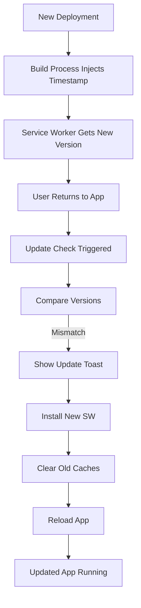

# PWA Automatic Update System

## Overview
The PWA automatic update system ensures users always receive the latest version without manual intervention or reinstallation. When a new deployment is detected, the app automatically updates and reloads seamlessly.

## How It Works

### Update Detection Flow



### Components

#### 1. PWAUpdateNotification Component
**Location**: `src/components/common/PWAUpdateNotification.tsx`

Handles the automatic update flow:
- Listens for `pwa-update-available` events
- Shows "Updating to latest version..." toast
- Clears old caches before reload
- Reloads app after 3-second delay
- Prevents update loops with session flags

#### 2. Service Worker Registration
**Location**: `src/components/common/ServiceWorkerRegistration.tsx`

Enhanced with update detection:
- Listens for service worker `updatefound` events
- Dispatches `pwa-update-available` events to app
- Checks for updates periodically (every 30 minutes)
- Monitors controller changes for new versions

#### 3. Service Worker
**Location**: `public/sw.js`

Improved cache strategy:
- Dynamic cache versioning using build timestamp
- Aggressive old cache cleanup on activation
- Immediate activation with `skipWaiting()`
- Version info accessible via message passing
- Sends `SW_ACTIVATED` messages to clients

#### 4. Version Checking
**Location**: `src/utils/versionCheck.ts`

Compares deployed vs running versions:
- Fetches `version.json` on app focus
- Compares build timestamps
- Caches version info (5-minute TTL)
- Handles offline scenarios gracefully
- Stores current version in localStorage

#### 5. Update Logging
**Location**: `src/utils/updateLogger.ts`

Tracks update events for diagnostics:
- Logs all update lifecycle events
- Stores logs in localStorage (7-day retention)
- Provides statistics and summaries
- Integrates with PWADebugPanel
- Exports logs for troubleshooting

#### 6. Update Hook
**Location**: `src/hooks/usePWAUpdate.ts`

Provides React interface for updates:
- Checks for updates on app focus
- Debounces checks (1-minute minimum)
- Exposes update state to components
- Handles manual update triggers
- Error handling and recovery

## Build Process

### Version Generation
**Script**: `scripts/generate-version.js`

Run automatically during build:
1. Generates unique build timestamp
2. Creates `dist/version.json` with version info
3. Injects timestamp into `dist/sw.js`
4. Captures git commit hash (if available)

### Build Commands
```bash
# Local build
npm run build:web

# Netlify build (production)
npm run build:web:netlify
```

Both commands now include `node scripts/generate-version.js` at the end.

## Update Triggers

### Automatic Triggers
1. **App Focus**: When user returns to app after being away
2. **Periodic Check**: Every 30 minutes while app is open
3. **Controller Change**: When new service worker takes control
4. **Visibility Change**: When app tab becomes visible

### Manual Triggers
```typescript
import { usePWAUpdate } from '../hooks/usePWAUpdate';

function MyComponent() {
  const { checkForUpdates, installUpdate } = usePWAUpdate();
  
  // Manual check
  await checkForUpdates();
  
  // Manual install
  await installUpdate();
}
```

## Configuration

### Update Check Frequency
Minimum 1 minute between checks (configurable):
```typescript
const { updateState } = usePWAUpdate({
  minCheckInterval: 60000, // 1 minute (default)
});
```

### Reload Delay
Time before auto-reload (default 3 seconds):
```tsx
<PWAUpdateNotification 
  reloadDelay={3000}
  showNotifications={true}
/>
```

### Periodic Check Interval
Service worker checks every 30 minutes (configurable in ServiceWorkerRegistration.tsx):
```typescript
const updateInterval = setInterval(() => {
  registration.update();
}, 30 * 60 * 1000); // 30 minutes
```

## User Experience

### Update Flow Timeline
1. **T+0s**: User returns to app → Update check triggered
2. **T+2s**: Update detected → Toast appears
3. **T+2s**: New service worker installs
4. **T+3s**: Old caches cleared
5. **T+5s**: App reloads automatically
6. **T+7s**: User sees updated app with success toast

### User-Visible Messages

**During Update:**
```
Updating Application
Installing latest version...
```

**After Update:**
```
App Updated Successfully
You are now running the latest version
```

**On Error:**
```
Update Failed
Please refresh the page manually
```

## Debugging

### Browser Console
Enable detailed logging:
```javascript
// View service worker state
console.log(window.__swRegistration);

// View current version
console.log(window.__swRegistration?.active?.postMessage({type: 'GET_VERSION'}));

// Check update logs
import { getLogSummary } from './src/utils/updateLogger';
console.log(getLogSummary());
```

### PWA Debug Panel
Available at: App with `?pwa-debug=true` query parameter

Shows:
- Service worker registration status
- Current version information
- Update check history
- Cache status
- Manual update trigger buttons

### Update Statistics
```typescript
import { getUpdateStats } from '../utils/updateLogger';

const stats = getUpdateStats();
console.log('Total checks:', stats.totalChecks);
console.log('Success rate:', stats.successRate);
console.log('Last update:', stats.lastUpdate);
```

## Troubleshooting

### Updates Not Detected

**Check**:
1. Service worker registered: `navigator.serviceWorker.controller`
2. Version file exists: Fetch `/version.json`
3. Update logs: `getUpdateLogs(10)` from updateLogger
4. Cache control headers: Check Network tab in DevTools

**Fix**:
```typescript
// Force update check
const { checkForUpdates } = usePWAUpdate();
await checkForUpdates();

// Clear version cache
import { clearVersionCache } from '../utils/versionCheck';
clearVersionCache();
```

### App Doesn't Reload

**Check**:
1. Browser console for errors
2. Network connectivity
3. Service worker state: `registration.waiting`
4. Session storage flags: `pwa-update-in-progress`

**Fix**:
```typescript
// Force reload
import { usePWAUpdate } from '../hooks/usePWAUpdate';
const { forceReload } = usePWAUpdate();
forceReload();

// Or manually
window.location.reload();
```

### Old Content Still Showing

**Check**:
1. Cache storage: DevTools → Application → Cache Storage
2. Service worker version: Check console logs
3. Build timestamp in sw.js

**Fix**:
```typescript
// Clear all caches
import { clearPWACache } from '../utils/pwaUtils';
await clearPWACache();

// Reset version tracking
import { resetVersionTracking } from '../utils/versionCheck';
resetVersionTracking();
window.location.reload();
```

## Testing

### Local Testing

1. **Build Initial Version**:
```bash
npm run build:web
npx serve dist
```

2. **Install PWA**: Visit http://localhost:3000 and install

3. **Make Code Changes**: Edit any component

4. **Build New Version**:
```bash
npm run build:web
```

5. **Reload Server**: Restart serve

6. **Test Update**: Return to PWA tab → Should auto-update within 5 seconds

### Deployment Testing

1. **Deploy Version 1**: Push to production
2. **Install PWA**: Install on device
3. **Deploy Version 2**: Push new changes
4. **Wait 30 seconds**: Let deployment complete
5. **Return to PWA**: Switch to app tab
6. **Verify Update**: Should show update toast and reload

### Multi-Tab Testing

1. Open PWA in 3 tabs
2. Deploy new version
3. Focus each tab sequentially
4. Verify all tabs update without conflicts

## Version File Format

**Location**: `dist/version.json`

```json
{
  "version": "1.0.0",
  "buildTime": "1710432000000",
  "buildDate": "2026-03-21T12:00:00.000Z",
  "commit": "abc1234",
  "environment": "production"
}
```

## Cache Naming Convention

All caches use build timestamp:
- `app-cache-[TIMESTAMP]` - Main cache
- `static-[TIMESTAMP]` - Static resources
- `runtime-[TIMESTAMP]` - Runtime resources

Old caches automatically deleted on activation.

## Performance Impact

### Update Check Performance
- Version check: ~50-100ms (cached)
- Service worker update: ~200-500ms
- Cache clearing: ~100-300ms
- Total: < 1 second

### Network Usage
- Version check: ~500 bytes
- Service worker: ~3-5 KB (cached)
- No impact on app load time

### Storage Usage
- Update logs: ~10-50 KB (7-day retention)
- Version cache: ~500 bytes
- No significant storage impact

## Security Considerations

### Version Integrity
- Version.json served over HTTPS
- Cache-Control headers prevent tampering
- Build timestamp ensures uniqueness
- Git commit hash for traceability

### Update Safety
- Old version continues if update fails
- No partial updates (atomic reload)
- Session flags prevent reload loops
- Rollback via cache retention (until cleared)

## Future Enhancements

### Planned Features
- Update changelog display in notification
- Scheduled updates during idle time
- Delta/incremental updates for large files
- Update progress indicator
- Manual "Check for updates" in settings
- Update analytics dashboard
- A/B testing for update strategies

### Considerations
- Background sync for offline updates
- Update staging/rollback system
- User preferences for update timing
- Network-aware updates (WiFi vs cellular)

## Support

If users experience update issues:
1. Check browser console for errors
2. Export update logs: `exportUpdateLogs()`
3. Verify version.json is accessible
4. Confirm service worker registered
5. Manual fallback: Clear cache and reload
